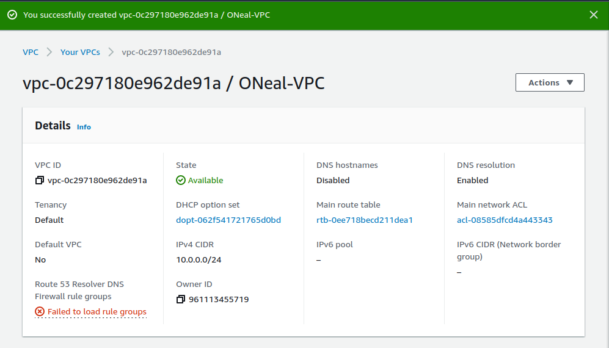
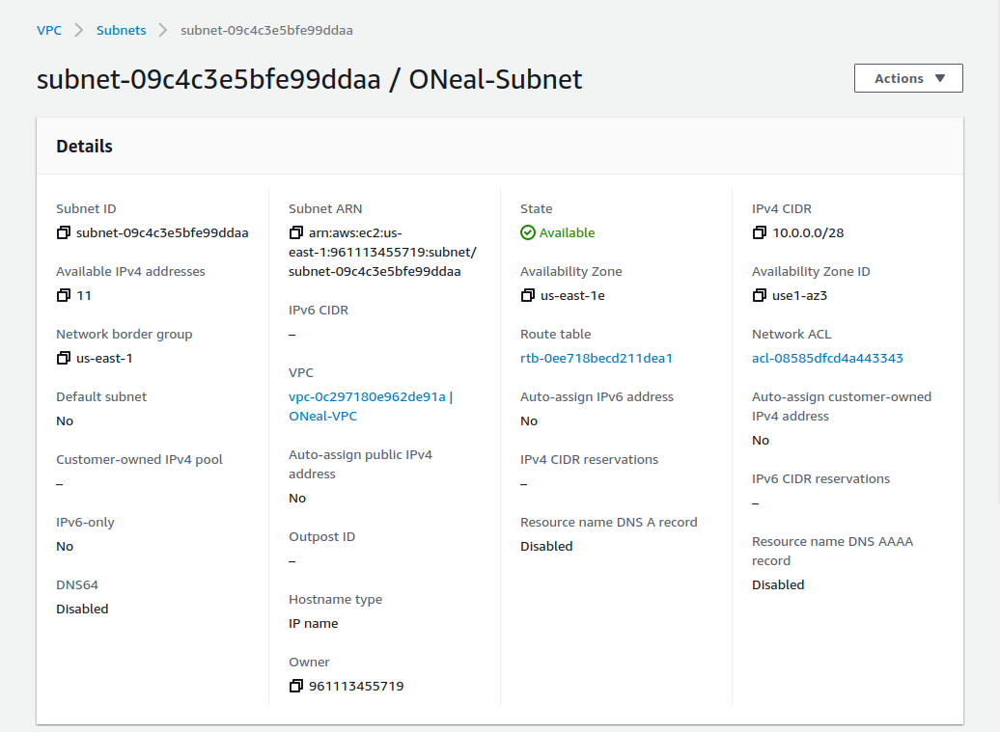
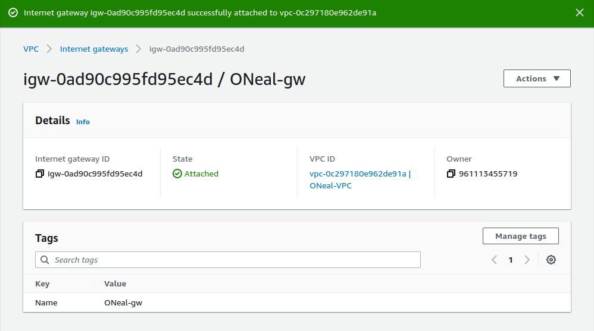
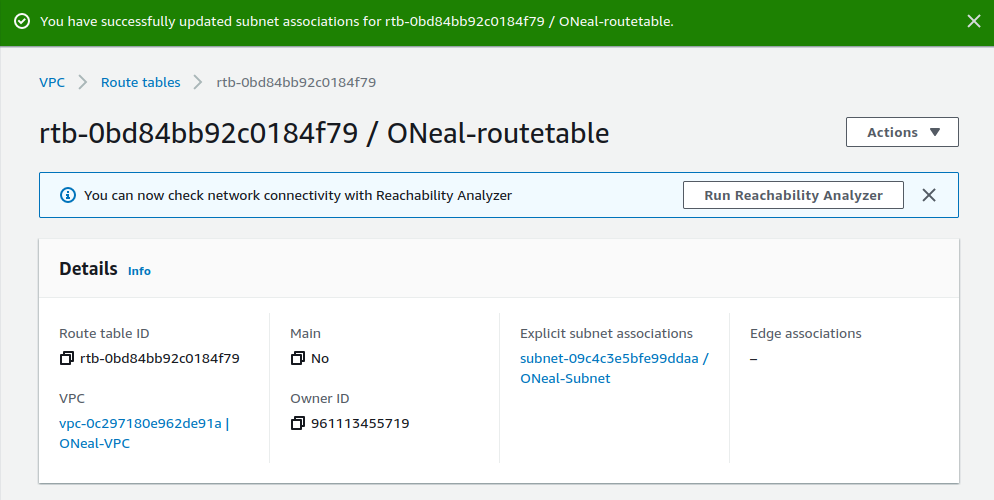
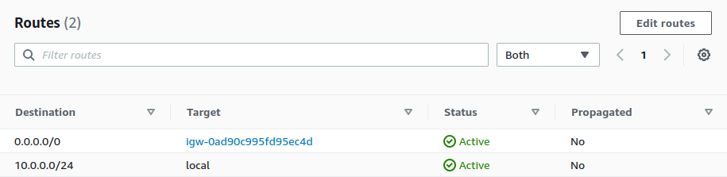
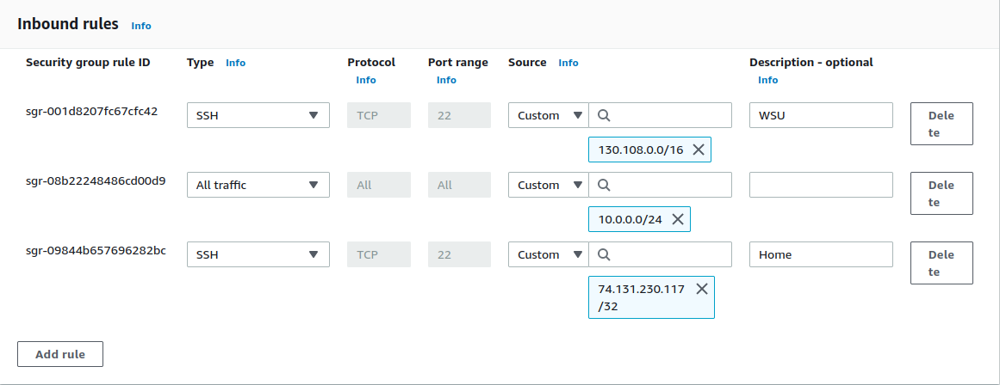
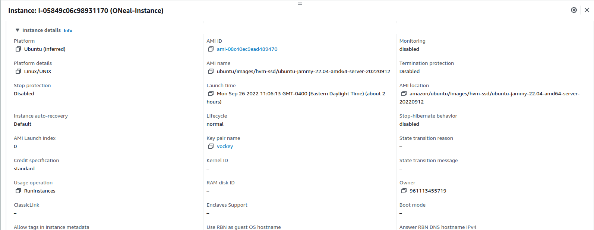
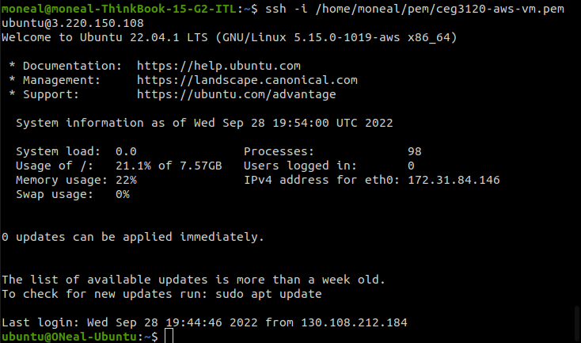

- Name: Michael O'Neal
- Email: oneal.43@wright.edu
- Project 2

## Part 1

1. VPC created & configured & role described
   
2. Subnet created & configured & role described
   
3. Internet gateway created & configured & role described
   
4. Route table created and configured & role described
   
   
5. Security group created and configured & role described
   
   

## Part 2

1. Instance details
   - AMI selected
	- Ubuntu
     - default username of the instance type selected
	- ami-08c40ec9ead489470
   - Instance type selected
	- t2.micro
2. How to attach instance to VPC
  - To attach the instance to a VPC, 
3. Public IP address auto-assign - yay or nay and why?
  -
4. How to create and attach storage volume to instance
  - Under configure storage, there are two different methods to adding storage volumes to your instance. I opted to use simple but there is the option to use advanced where you can dictate size, volume type, add encryption, and choose if the volume is deleted when the instance is terminated. 
5. How to tag instance with "Name" of "YOURLASTNAME-instance"
  - When creating an instance, you have the abiity to tag the instane and give it a name. 
6. How to associate VPC security group (your security group) with your instance
  - To associate VPC security groups with my instance, under "Firewall (security groups)" in the instance, check "Select existing security group". You can then see all security groups for the instance under "Common security groups". Select the security group for the VPC that was created in an earlier step.
7. How to create / reserve and associate and Elastic IP address with your instance
  -
8. Screenshot with instance details
   
9. How to change hostname via commands on instance
  -
10. Screenshot of successful SSH connection to instance (with your new hostname instead of ip-##-##-##-##)
   
